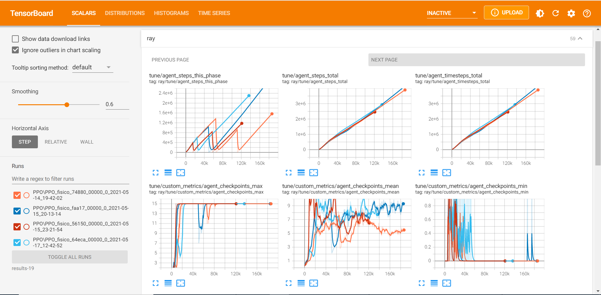

# Projeto Físico

## Instalação

Para realizar o treino é necessário instalar os pacotes listados no [Pipfile](Pipfile). Isto é feito através do seguinte comando:

```bash
# Instala as bibliotecas necessárias
sudo apt update
sudo apt install cmake
pip install --user pipenv
pipenv install
```

## Baixando os binários

Para executar o projeto é necessário baixar os binários dos agentes, para isto usaremos o [gdown](https://pypi.org/project/gdown/)

```bash
pip install gdown
```

Em seguida, utiliza-se o gdown para baixar do google drive os arquivos necessários:

```bash
gdown --id 1EGIZ9NQ-M-Sp_QEPNRd-OzsbxoWxU4hu --output CarAgentRL.tar.gz
tar xf CarAgentRL.tar.gz
```

## Treinamento

Para treinar os agentes basta executar o arquivo [`train.py`](src/train.py) da seguinte forma:

```bash
python src/train.py -f CarAgentRL/CarAgentRL
```

### Flags

Algumas flags podem ser passadas para o script de treino, elas são:

| Flag              | Função                                                   | Tipo                              | Default               |
| ----------------- | -------------------------------------------------------- | --------------------------------- | --------------------- |
| --file_name, -f   | Indica local e nome do arquivo de agentes a ser treinado | String                            | Nada                  |
| --log_level, -l   | Define a forma como o treino vai gerar um registro       | String (DEBUG, INFO, WARN, ERROR) | WARN                  |
| --agents          | Número total de agentes a serem executados               | Int                               | 256                   |
| --workers         | Número total de CPU's a serem utilizadas no treino       | Int                               | [Número de CPU's] - 1 |
| --gpus            | Número de GPU's a serem utilizadas no treino             | Int                               | Todas as disponíveis  |
| --max_train_iters | Número de iterações de treino a serem executadas         | Int                               | 512                   |
| --time_scale      | Quão rápido o jogo será executado                        | Float                             | 1000                  |
| --framework       | Escolhe qual framework utilizar entre Torch e TensorFlow | String (torch, tf)                | torch                 |

## Visualização

Existem atualmente duas formas de visualizar os resultados do treinamento: TensorBoard e plot_results.py.

### Tensorboard

Para utilizar essa ferramenta, é necessário possuir a biblioteca tensorflow instalada. Em seguida, execute o seguinte comando para executá-la e visualizar o treinamento:

```bash
tensorboard --log-dir=<path/do/treinamento>
```

Para exemplificar, tomemos como base a estrutura abaixo:

```text
results
│
└───PPO
    │
    ├───PPO_fisico_64eca_...
    ├───PPO_fisico_56150_...
    ├───PPO_fisico_74880_...
    └───PPO_fisico_faa17_...
```

Executando o seguinte comando, abrirá o tensorboard com esses 4 experimentos:

```bash
tensorboard --log-dir=results
```



Podemos observar 4 cores diferentes nas curvas de cada gráfico, indicando os 4 experimentos distintos realizados.

### plot_results.py

Dentro da pasta src, existe um código chamado "plot_results.py". Essa função apresenta diversos parâmetros que serão explicados abaixo:

- EXPERIMENT : Path para o experimento. Único parâmetro obrigatório dessa função.
- --no-phase : Remove a informação do nível (dificuldade do jogo) nos gráficos. Opcional.
- --no-noise : Remove ruído nas colunas de 'hist_stats'. Opcional.
- --window (-w) : Tamanho da janela para média móvel. Opcional, valor padrão igual a 10.
- --dpi : DPI da figura gerada. Opcional, valor padrão igual a 120.
- --no-default-columns : Não gera gráficos das colunas padrão. Opcional.
- --column : Colunas adicionais para gerar o gráfico. Opcional.

Execução do código:

```bash
python plot_results.py <path/do/experimento>
```
